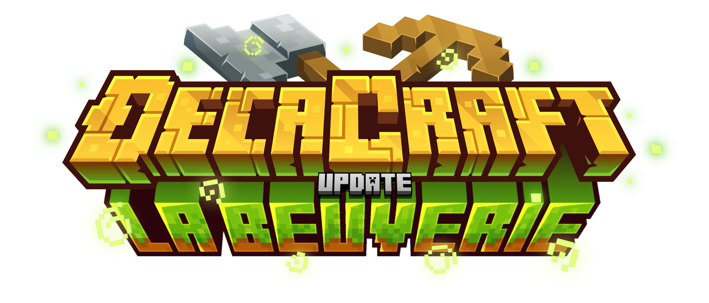
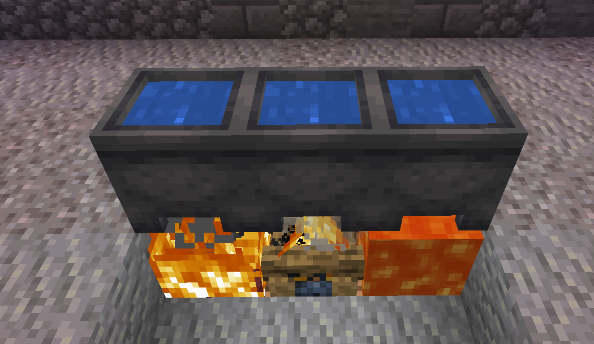
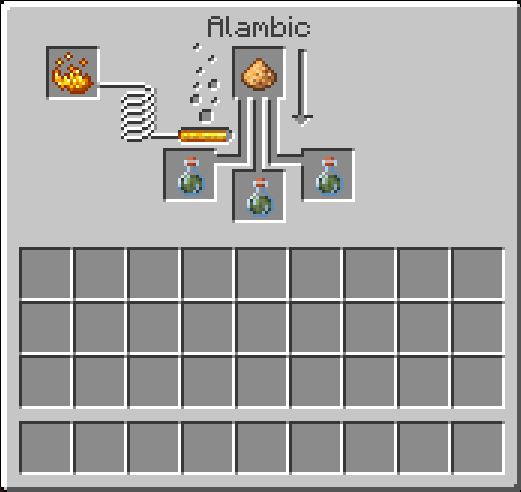
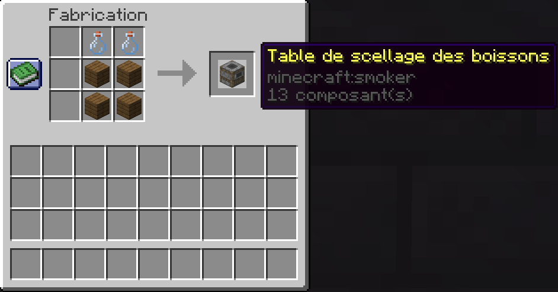

# Boisson et Alcool

Faire des boissons et de l’alcool sur Decacraft est possible depuis la mise à jour **La Beuverie**. Une série de succès est liée à la création de boissons.

### Les Recettes
---
Un livre de recettes est donné aux joueurs par le PNJ Rodolphe, disponible à la taverne du spawn. Ainsi, toutes les recettes seront visibles dans votre livre.
Le livre des recettes vous appartient et seul vous pouvez l’ouvrir.
L’obtention des recettes se fait en complétant les succès liés à la création de boissons.

Une recette se décompose en quatre étapes : la cuisson, la distillation, la fermentation et le scellage.

### La Cuisson
---
Pour commencer une cuisson, vous devez placer un chaudron rempli d’eau sous une source de chaleur (feu, lave, feu de camp).
L’étape suivante consiste à ajouter les ingrédients dans votre chaudron. Munissez-vous de vos ingrédients et insérez-les à l’aide d’un clic droit.
Votre ingrédient disparaît, et des particules apparaissent au-dessus du chaudron.
Laissez cuire le temps indiqué dans la recette. La durée compte pour la qualité de la boisson : utilisez donc une montre et faites un clic droit sur le chaudron pour connaître le temps d’ébullition.
À l’aide de bouteilles en verre, vous pouvez récupérer votre mélange.

---

### La Distillation
---
La distillation est une étape clé du processus de fabrication des boissons.
Pour commencer, placez les bouteilles issues de la première étape dans un alambic.
Dans cet alambic, ajoutez une poudre de blaze dans le compartiment du carburant, et une poudre lumineuse dans le compartiment des ingrédients.
Ces deux objets ne seront pas consommés.

---

### La Fermentation
---
Une fois la distillation terminée, la boisson doit être vieillie afin de développer ses arômes.
Placez la boisson dans un tonneau en bois. Il existe deux types de tonneaux :

le petit tonneau, contenant 9 places,

le grand tonneau, contenant 27 places.

Voici comment les construire :

---

### Le Scellage
---

Le scellage marque la fin du processus de fabrication. Il permet de stabiliser la boisson pour qu’elle n’évolue plus dans le temps.
Insérez vos boissons dans la table de scellage. Un son distinctif ainsi que l’affichage de la qualité de la boisson marqueront son scellage.
Le craft de la table de scellage est disponible dans les recettes Minecraft.

Une fois scellée, la boisson devient un produit fini, prêt à être consommé ou vendu.

---

### La Vente
---

Il est possible de vendre vos boissons contre des Ð auprès du PNJ Amaury dans la taverne du spawn.
Cependant, il achète uniquement les boissons de qualité parfaite, symbolisées par [★★★★★].

### La Foire aux Questions
---

**- Comment débloquer les recettes ?**  
Pour débloquer une nouvelle recette , il faut atteindre le palier 5 dans une boisson. La recette est donné automatiquement dans le */reward*. Tu peux voir les boissons débloqué dans le */succes*

**- Est-ce que le temps passe même quand la zone n’est pas chargée ?**  
Oui. Le temps continue de s’écouler même quand la zone est déchargée. 
Cela signifie que :   
Les boissons dans les chaudrons continuent de cuire.  
Les boissons dans les tonneaux continuent de vieillir.

**- Est-ce que le fait de dormir accélère le processus dans les chaudrons ou tonneaux ?**  
Non. Le temps est basé sur le temps réel (IRL) :  
Dans un chaudron, 1 minute réelle = 1 minute de cuisson  
Dans un tonneau, 1 jour Minecraft = 20 minutes réelles

**- Comment construire les tonneaux ?**  
Petit tonneau : 8 escaliers du même bois + une pancarte avec écrit "barrel" (à placer en dernier).
Grand tonneau : 16 escaliers, 20 planches et 1 barrière du même bois + une pancarte avec écrit "barrel" (à placer en dernier).

**- Quelle est la différence entre les tonneaux ?**  
Le bois doit impérativement être du même type, certaines recettes nécessitent un bois précis.
La taille influe sur la capacité :  
Petit tonneau = 9 emplacements  
Grand tonneau = 27 emplacements  
Le baril minecraft fait office de tonneau en chêne.

**- Les ressources dans l’alambic sont-elles consommées ?**  
Non. Pour rappel, il faut une poudre de blaze et une poudre lumineuse pour faire fonctionner l’alambic, mais ces deux ressources ne sont pas consommées.

**- Comment valider les paliers de succès ?**  
Deux étapes :  
La boisson doit être notée 5 étoiles → cela demande de respecter exactement la recette, de ne pas oublier ou ajouter d’ingrédient, et de ne pas dépasser le temps de cuisson.  
La boisson doit ensuite être scellée → c’est cette action qui valide le palier.

**- Peut-on vendre toutes les boissons au PNJ Amaury ?**  
Non. Seules les boissons parfaites (5 étoiles + scellées) peuvent être vendues au PNJ Amaury.

**- Est-ce que plusieurs joueurs peuvent utiliser le même tonneau ?**  
Oui. Un tonneau est partagé et accessible à tous les joueurs tant qu’il n’est pas protégé. Vous pouvez donc vieillir vos boissons dans le même tonneau qu’un autre joueur.

**- Est-ce qu’une boisson continue de vieillir même si elle a dépassé le temps recommandé ?**  
Oui. Cependant, sa qualité peut diminuer si elle reste trop longtemps dans le tonneau.

**- Que se passe-t-il si je me trompe dans une recette ?**  
La boisson sera de mauvaise qualité (moins d’étoiles) et pourra donner des effets négatifs. Elle ne comptera pas pour débloquer les paliers.
