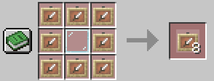
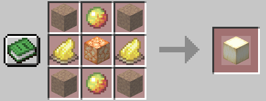
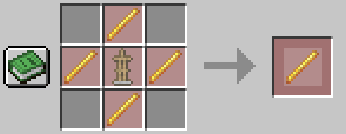

# Liste des recettes personnalisées

### Cadre invisible
---
Fonctionne exactement comme un cadre sauf que celui-ci est invisible.

### Ardoise des abîmes renforcée
---

### Les Grelampes
---

### Carte indestructible
---

### Coffre alpha
---
Voir le wiki sur [MasterSDC](https://wiki.decacraft.net/mastersdc/)

### Editeur de porte armure
---
Voir le wiki sur [Les portes armures personnalisés](https://wiki.decacraft.net/easyarmorstand/)

