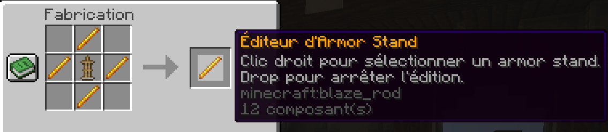
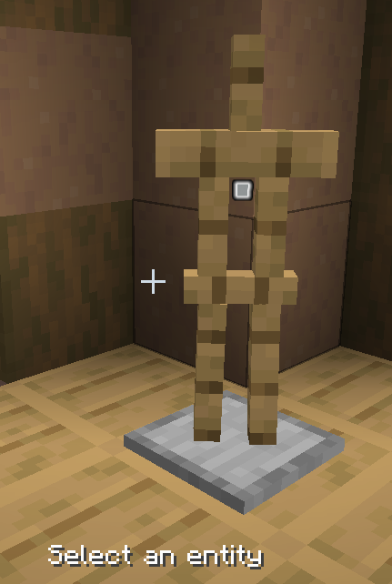
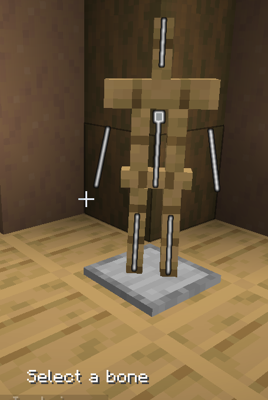
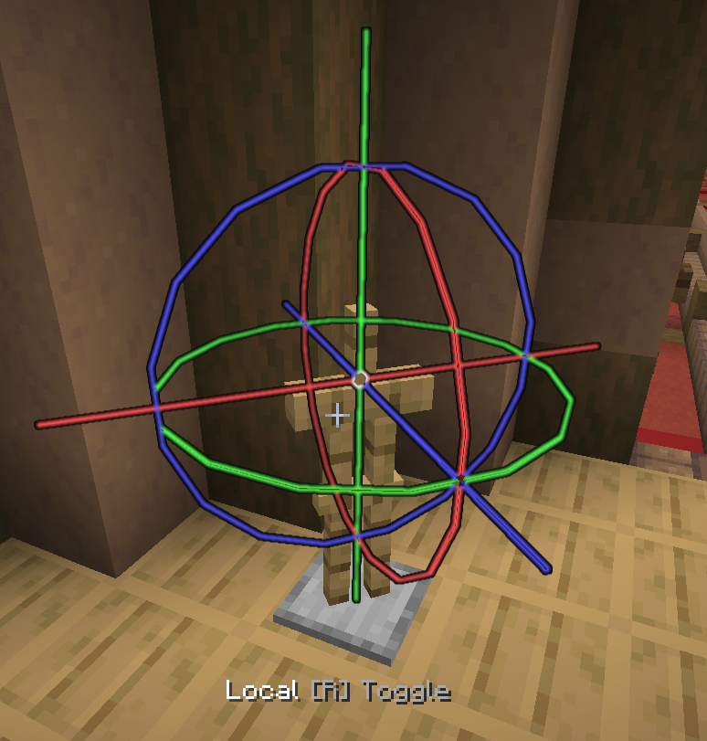
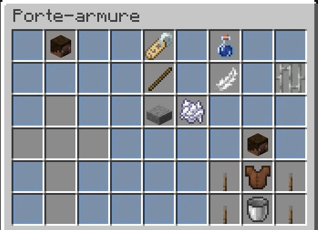
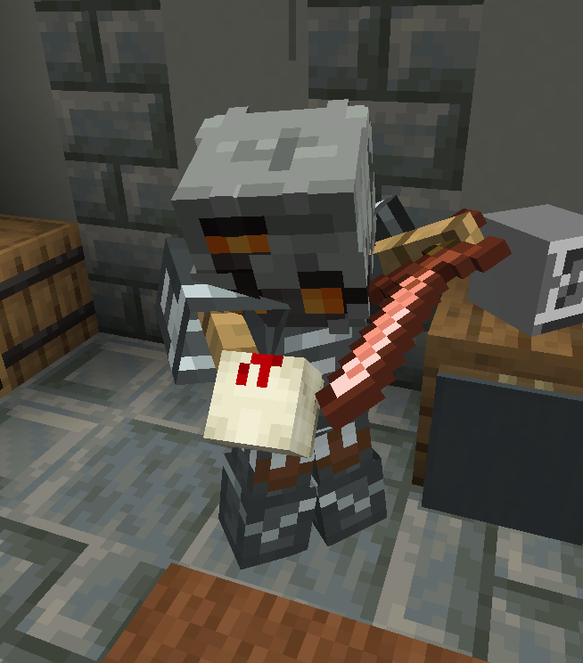
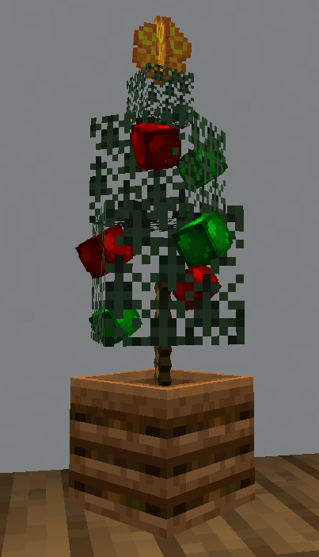

# Les portes armures personnalisés

Les portes d'armures personnalisées sont possibles grâce au plugin EasyArmorStand (EAS). EasyArmorStand permet de modifier facilement les porte-armures dans Minecraft sans utiliser de commandes.
Tout se fait avec un outil spécial : l'Éditeur  d'Armor stand

### Craft du Bâton Éditeur

Ce bâton se fabrique via la table de craft.

---
### Utilisation du Bâton Éditeur 
---
Avec votre bâton éditeur en main, cliquez droit sur le petit carré lumineux pour sélectionner le porte-armure.

Une fois sélectionné, des barres virtuelles apparaissent au niveau des bras, des jambes, de la tête, du corps et encore le petit carré lumineux au milieu du porte-armure. Vous pouvez sélectionner une de ces parties en mettant votre curseur sur une des barres et faire un clic-droit.

De nouvelles barres apparaissent correspondant aux axes. Vous pouvez déplacer le porte-armure via ces axes en visant l'une de ces barres virtuelle puis en faisant un clic-droit.

Le déplacement se fait en bougeant votre curseur. Petite astuce, en s'accroupissant, le déplacement sera plus précis.   

Pour valider la position du porte-armure, faites un clic droit, si vous souhaitez annuler faites un clic gauche.  

Vous pouvez également bouger le porte-armure complet en faisant clic-droit sur le carré lumineux central.

Dans l'interface virtuelle de la photo de sélection des membres, vous pouvez sélectionner, avec le clic gauche, le petit carré lumineux pour appliquer des options à ce porte-armure. Les options possibles sont :
- Mettre un nom

Vous pouvez ajoutez des couleurs en mettant entre "<>" les couleurs suivantes :
_black, dark_blue, dark_green, dark_aqua, dark_red, dark_purple, gold, gray, dark_gray, blue, green, aqua, red, light_purple, yellow, ou white_. Vous pouvez mettre aussi des couleurs hexadecimale en ajoutant un #avant le code hexadecimale.   Exemple : _<#FF7676>Bonjour !_

Il se peut que le nom que vous avez ajouté n'apparait pas. Pour resoudre ce problème selectionner le porte armure et faite la commande   ``/eas name visible true``  

- Rendre invisible le porte-armure
- Ajouter des bras au porte-armure
- Désactiver la gravité du porte-armure
- Les équipements ne peuvent être retirés que via l'éditeur
- Enlever la base du porte-armure
- Réduire la taille du porte-armure

Vous pouvez copier les paramètres d'un porte armure en le selectionnant avec l'éditeur et en entrant la commande suivante : **/eas copy**

Pour annuler la copie des paramètres, utiliser la commande suivante : ``/eas clipboard clear``

---
### Idée d'utilisation décoration avec l'éditeur
---
Voici quelques exemples simples de ce qu'on peut créer avec cet outil.

