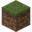
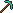
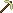

# Les Mondes
---

Sur le serveur il y a différents mondes qui te permettent différentes choses. Respecte bien l'utilité de chaque monde.
Vous pouvez repérer le monde où vous vous trouvez et ou les joueurs se trouve en regardant l'icone devant le pseudo des joueurs dans le "tab" ou dans le tchat.

### Les monde de contruction
---
Dans ces mondes, vous pouvez laissez libre court à votre imagination pour y construire ce que vous voulez... dans la limite du règlement bien entendu !
-  Le monde Principal
-  Le monde Nether
-  Le monde End

Merci de ne pas recolter les ressources dans ces mondes pour y preserver le paysage.

### Les mondes de ressources
---
Dans ces mondes, vous pouvez tout piller, tout détruire. Mais ne construisez pas, ils peuvent être réinitialisés.
-  Le monde Ressources
-  Le monde Ressources Nether
-  Le monde Ressources End
